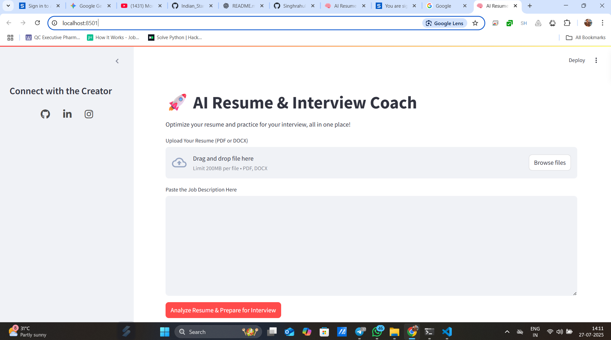
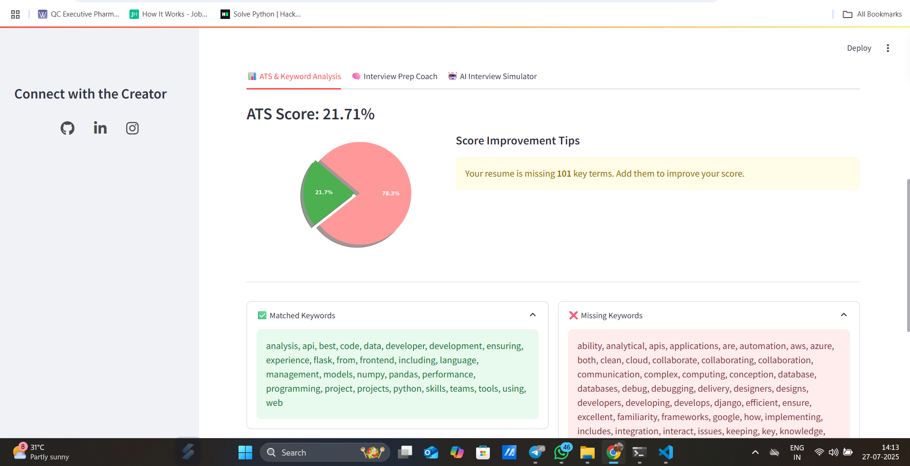
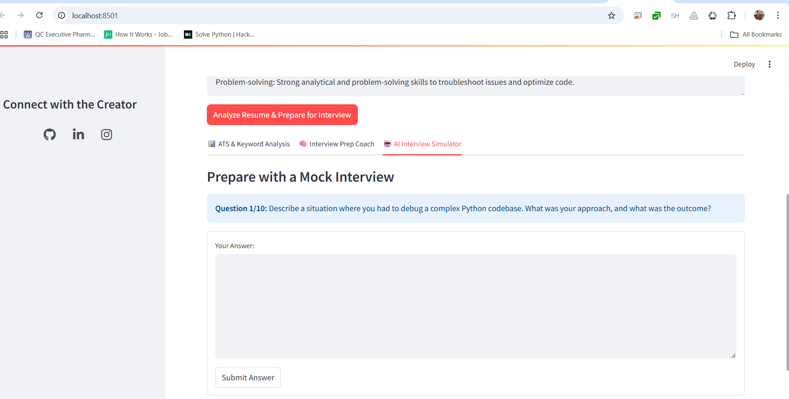

# 🚀 AI Resume & Interview Coach

<p align="center">
  
  
  
  
</p>

<p align="center">
  <b>🌟 An Advanced AI-Powered Tool to Optimize Your Resume and Ace Your Interviews! 🌟</b>
</p>

---

## 🔗 Live Demo
🔥 **Try it Now:** [**ai-resume-interview-coach.streamlit.app**](https://ai-resume-interview-coach.streamlit.app/)

*(Note: Live deployment is hosted via Streamlit Community Cloud)*

---

## 🌟 Overview

**AI Resume & Interview Coach** is a next-generation, powerful AI-driven web application tailored for students, job seekers, and developers. By leveraging Google's Gemini LLMs and LangChain, it provides end-to-end recruitment assistance.

### ✨ What can it do?
- **Resume Optimization:** Make your resume ATS-friendly.
- **Mock Interviews:** Face AI-generated technical & behavioral questions based directly on your resume.
- **Real-Time Feedback:** Get evaluated like a real technical recruiter.

---

## 🔥 Key Features

### 🔍 ATS Resume Analyzer
- **Instant ATS Score:** Discover how well your resume matches the job description.
- **Missing Keywords Detector:** Automatically identify crucial skills missing from your resume.
- **Visual Analytics:** View beautiful charts for actionable insights.

### 🧠 AI Interview Prep Coach
- **Behavioral Questions:** Practice with tailored STAR-method questions.
- **Technical Screen:** Answer subject-matter expert questions based on your specific skill set.

### 🤖 Live Mock Interview Simulator
- **Real-time Interaction:** Chat directly with the Gemini-powered AI.
- **Role-based Simulation:** The AI dynamically adapts its persona to the Job Title you provide.

### 📊 Performance Feedback & Summary
- **Detailed Evaluation:** Receive honest, constructive feedback on your responses.
- **Strengths & Weaknesses:** Get actionable advice to help you crack the real interview.

---

## 🖥️ Sneak Peek (Demo)

<p align="center">
  
</p>

<p align="center">
  
</p>

<p align="center">
  
</p>

---

## ⚙️ Workflow & Localhost Setup

Follow these steps to run the application on your local machine:

1. **Clone the Repository:**
   ```bash
   git clone https://github.com/chitranjan-patel/ai-resume-interview-coach.git
   cd ai-resume-interview-coach
   ```

2. **Install Required Packages:**
   ```bash
   pip install -r requirements.txt
   ```

3. **Set up API Key:**
   - Create a folder named `.streamlit` in the root directory.
   - Inside it, create a file named `secrets.toml`.
   - Add your Google Gemini API Key in the following format:
     ```toml
     GOOGLE_API_KEY = "your_api_key_here"
     ```

4. **Launch the App:**
   ```bash
   streamlit run app.py
   ```
   > 💡 The app will automatically open in your default browser at `http://localhost:8501`.

---

## 🧠 Tech Stack

<p align="center">
  
  
  
  
  
</p>

---

## 👨‍💻 Creator

<p align="center">
  <b>Chitranjan Kumar Patel</b><br><br>
  
  <a href="https://github.com/chitranjan-patel" target="_blank">
    
  </a>

  <a href="https://www.linkedin.com/in/chitranjan-kumar-patel-155674232/" target="_blank">
    
  </a>
  
  <a href="https://www.instagram.com/vipul_patel0.2?stkn=eHlhaGVlYXZicncw" target="_blank">
    
  </a>
</p>
